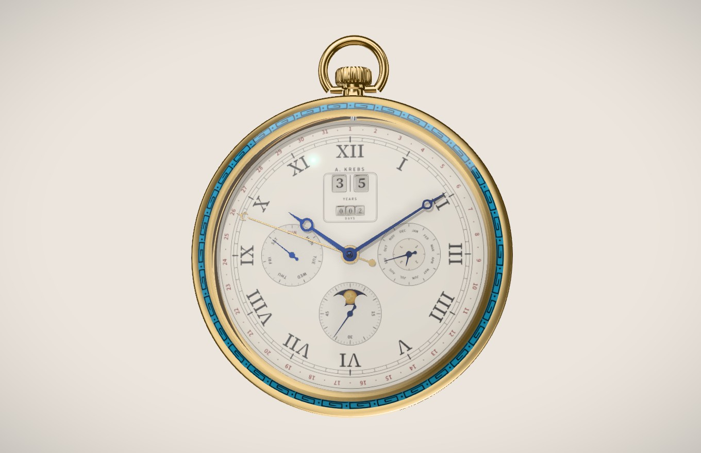

# Life watch

A mechanical pocket watch that counts your life, rendered live in the browser.



Under XII two big-date discs count your **years** and three odometer drums count the **days since your last birthday**. Read them with the hands and the watch gives your exact age: years, days, hours, minutes and seconds. Around them sits a **perpetual calendar**: day of the week at IX, month and four-year leap cycle at III, the date on a gold hand around the edge, and a precision moon at VI.

Press **Explode** to take it apart: every wheel, lever, jewel and screw separates layer by layer, with labels. Hover a part to find out what it does, run the watch at 1/20× to see the escapement tick, or a month per second to watch the perpetual calendar work through a leap year.

## Make your own

Open the website, enter your name and birthday, pick a case metal and an enamel colour, and you get your own watch at a link like

```
https://<your-deployment>/?name=Jane+Doe&born=1990-06-15&metal=rose
```

Nothing is stored anywhere: the watch lives entirely in its link.

## Put it on your site

### Any page: one script tag

```html
<script type="module" src="https://cdn.jsdelivr.net/npm/life-watch/dist/life-watch.js"></script>

<!-- The full watch (give it a height) -->
<life-watch name="Jane Doe" born="1990-06-15" style="height: 720px"></life-watch>

<!-- Or a compact live picture, e.g. for an About page -->
<life-watch name="Jane Doe" born="1990-06-15" variant="embed"></life-watch>
```

| Attribute | Value |
| --- | --- |
| `name` | Your name, required |
| `born` | Birth date as `YYYY-MM-DD`, required |
| `place` | Shown on the label, e.g. `Switzerland` |
| `signature` | Printed under XII; defaults to `J. DOE` |
| `inscription` | Engraved around the display back |
| `metal` | `yellow` (default), `rose` or `white` |
| `enamel` | Bezel enamel colour as `#rrggbb` |
| `variant` | `full` (default) or `embed` |

### React

```bash
npm install life-watch three @react-three/fiber
```

```tsx
import { LifeWatch, LifeWatchEmbed } from 'life-watch';
import 'life-watch/style.css';

export default function About() {
  return <LifeWatch config={{ name: 'Jane Doe', born: '1990-06-15', metal: 'rose' }} />;
}
```

`LifeWatch` is the full experience and fills its container (set `--lw-height` or a height on its parent). `LifeWatchEmbed` is a non-interactive live picture that stays out of the way of scrolling; put it inside a positioned box with the aspect ratio you want, over an image if you'd like a poster while it loads.

The `config` object accepts everything the attributes do, plus:

- `engraving: [line1, line2]`: the barrel bridge engraving.
- `label: { title, subtitle, lines, footnote, inventory }`: the museum-style label on the full watch.
- `loadFonts: false`: don't add Source Serif 4 and Source Sans 3 from Google Fonts. Load them yourself, or the dial falls back to Georgia.

## How it works

Nothing is keyframed. Every moving part is a pure function of one simulated instant (`src/lib/time.ts`), so the watch runs live, paused, in slow motion or at a month per second, and is always right.

- **Going train, 18,000 vph.** The balance swings 2.5 times a second. A Swiss lever escapement modelled phase by phase (unlocking with recoil, impulse on the pallet, impulse on the tooth, drop) steps a 15-tooth club-tooth escape wheel 12° per beat. That runs back through the fourth, third and centre wheels (70/7, 60/8, 80/10) to a 96-tooth barrel. Teeth are cycloidal, and every pinion is phased so it really meshes.
- **Grand-lever perpetual calendar.** A snail on the 24-hour wheel cocks the grand lever all day, and it falls at midnight. The 31-tooth date star turns exactly once per calendar month: at the end of a short month the lever's feeler drops into the 48-month cam and carries it through two, three or four teeth. The age discs jump at midnight on your birthday (29 February birthdays move to 1 March in common years).
- **Geometry, all generated in the browser.** Bridges, levers and hands are drawn as smooth unions of 2D signed distance fields, contoured with marching squares and extruded with polished bevels. Côtes de Genève, perlage and sunray finishes are baked into anisotropy direction maps; the dial is painted on a canvas.
- **Rendering** with three.js, react-three-fiber and drei: studio lighting from Lightformers (no HDR downloads), ambient occlusion, Neutral tone mapping, and a synthesised tick-tock from a pre-rendered Web Audio loop.

```
src/lib/
  time.ts          the whole watch as a function of time
  layout.ts        positions, tooth counts, modules, z-levels
  config.ts        your config, shareable links
  model/           movement, dial side (calendar, counters, hands), case
  geometry/        SDF toolkit, cycloidal gears, shapes
  materials.ts     metals, enamel, rubies, baked finishes
  dial.ts          dial, discs, drums, moon and engraving artwork
  LifeWatch.tsx    full experience; LifeWatchEmbed.tsx compact; element.tsx <life-watch>
src/app/           the maker website
```

## Development

```bash
npm install
npm run dev          # the maker site on http://localhost:5173
npm run build        # library (dist/), <life-watch> script (dist/life-watch.js) and site (site-dist/)
```

The site deploys to Vercel as is (`vercel.json`) or to any static host: run `npm run build:site` and serve `site-dist/`.

## Credits

Inspired by Bartosz Ciechanowski's [Mechanical Watch](https://ciechanow.ski/mechanical-watch/), and by a Patek Philippe singing-bird box from 1866 with a perpetual calendar, and a Czapek demonstration movement, both seen in Geneva. Made by [Adrian Krebs](https://adriankrebs.ch).

MIT licensed.
